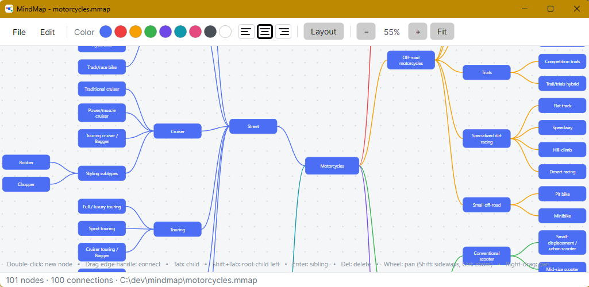

# MindMap

MindMap is a lightweight desktop app for creating and editing mind maps. It provides a pannable, zoomable canvas with quick keyboard-driven node creation, connector-based relationships, simple text alignment and color controls, outline copy/paste, undo, image export, and `.mmap` file persistence.

## Screenshot

## Features

- Create root nodes, child nodes, and sibling nodes directly on the canvas.
- Pan and zoom around large maps.
- Connect nodes into a clean hierarchy.
- Edit node text inline.
- Change node colors and text alignment.
- Copy and paste indented outlines.
- Save maps as `.mmap` files and export them as PNG or JPEG images.

